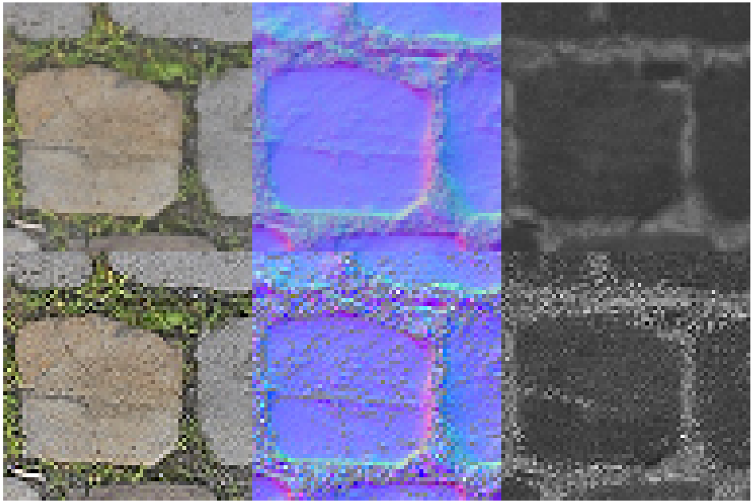
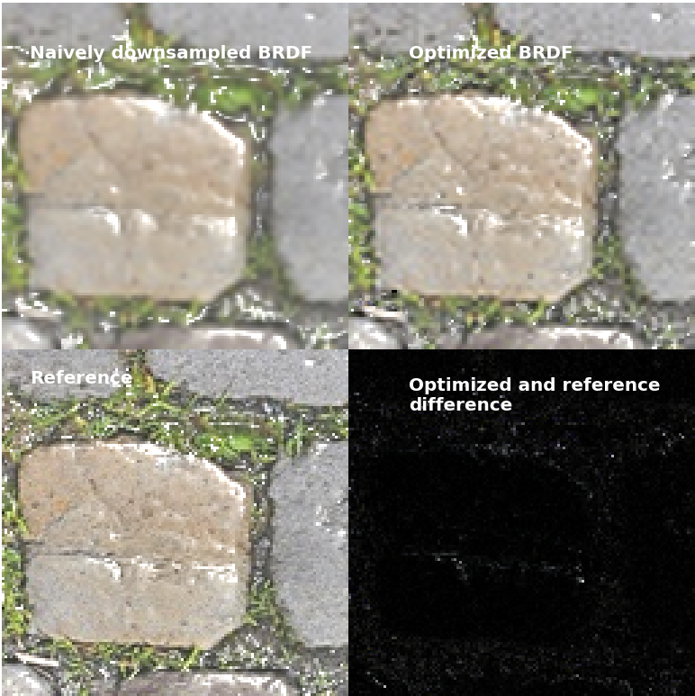
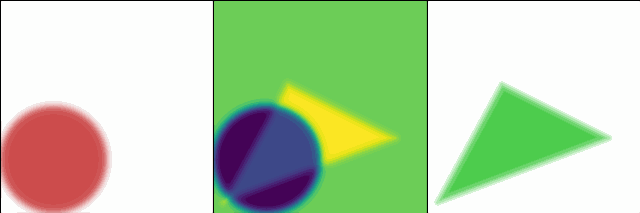
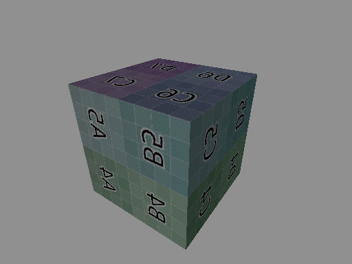
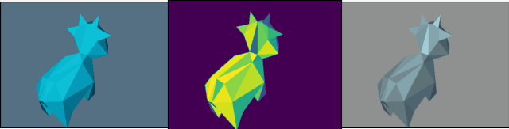

# Differential Rendering Experiment with Slang

This project is a set of experiments carried out using Slang, PyTorch with their auto-diff feature.

## Dependencies

- Slang（[https://github.com/shader-slang/slang](https://github.com/shader-slang/slang)）
- SlangPy（[https://github.com/shader-slang/slangpy](https://github.com/shader-slang/slangpy)）
- Slang-Torch（[https://github.com/shader-slang/slang-torch](https://github.com/shader-slang/slang-torch)）

## Contents

### Exp 1: PBR texture auto-LOD

> Check for [Tech blog written in Chinese](https://zrephel.fun/2025/03/20/%E5%8F%AF%E5%BE%AE%E6%B8%B2%E6%9F%93%E5%AE%9E%E9%AA%8C1%EF%BC%9A%E7%BA%B9%E7%90%86%E8%B4%B4%E5%9B%BELOD%E8%87%AA%E5%8A%A8%E4%BC%98%E5%8C%96/) here.

We render a plane with a specific PBR texture combination `(diffuse, normal, roughness)` in  `./resources`, and then render it again with

* naively `/2` downsampled textures (shown in upper row),
* optimized `/2` downsampled textures (shown in lower row):

We can see the optimized textures preserve more high-frequency details in a lower resolution. Thus the same for the rendering result below:

The optimization process is done with a random lighting and a fixed camera.

### Exp 2: Auto tuning SDF shader parameters

> Check for [Tech blog written in Chinese](https://zrephel.fun/2025/03/20/%E5%8F%AF%E5%BE%AE%E6%B8%B2%E6%9F%93%E5%AE%9E%E9%AA%8C2%EF%BC%9A%E5%8F%AF%E5%BE%AE%E5%85%89%E6%A0%85%E5%8C%96%E5%87%A0%E4%BD%95%E5%8F%82%E6%95%B0%E8%87%AA%E5%8A%A8%E8%B0%83%E6%95%B4/) here.

We minimize the difference between a fixed triangle and a flexible circle.

The geometry is represented using 2D SDF functions. The optimized parameters are the circle's `(position, radius, color)`.

### Exp 3: Differentiable renderer and auto parameter tuning

> Check for [Tech blog written in Chinese](https://zrephel.fun/2025/03/20/%E5%8F%AF%E5%BE%AE%E6%B8%B2%E6%9F%93%E5%AE%9E%E9%AA%8C3%EF%BC%9A%E5%8F%AF%E5%BE%AE%E5%85%89%E6%A0%85%E5%8C%96%E6%B8%B2%E6%9F%93%E5%99%A8%E7%BB%BC%E5%90%88%E5%AE%9E%E7%8E%B0/) here.
> The forward differentiable rasterization algorithm is based on the paper [*Soft Rasterizer: A Differentiable Renderer for Image-based 3D Reasoning*](https://arxiv.org/abs/1904.01786).

We render a model with a differentiable renderer. It currently supports:

* glTF model import
* Texture import and sampling
* Punctual lighting and PBR shading (in `shaders/soft_ras/`)

e.g. forward rendering of a textured cube:

This renderer is a playground for auto parameter tuning. e.g., fix the diffuse value, optimize `(bg_color, metallic)` for a spot model:

**Note:** This renderer relys on the **auto differentiation** feature of Slang. When `#face` of the model becomes large, the auto-diff process fails, manual differentiation is required.
